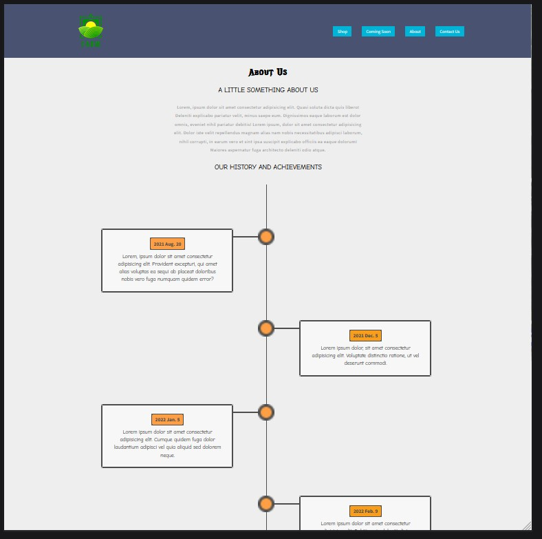

# eMobilis - Final Project(Eccomerce Sell Farm Produce)

This is was my final project the emobilis Expolrer class
I decided to create an eccomerce site to sell farm products, onions, oranges and such in bulk
I successfuly created a all responsive shopping cart and other pages
Planning to next create an admin dashboard to add products from anywhere, a login systemfor the buyers and a payment system maybe mpesa + paypal

## Table of contents

- [Overview](#overview)
  - [The challenge](#the-challenge)
  - [Screenshot](#screenshot)
  - [Links](#links)
- [My process](#my-process)
  - [Built with](#built-with)
  - [What I learned](#what-i-learned)
  - [Continued development](#continued-development)
  - [Useful resources](#useful-resources)
- [Author](#author)
- [Acknowledgments](#acknowledgments)

## Overview

### The challenge

Users should be able to:

- View items randomly generated from the `products` table in the `farm_produce` database created
- This products were manually added but in future planing to have a sellers page to be able to be an admin and add products
- Add cart items from the shopping cart `onions`, `oranges`, and `berries` to their cart
- Navigate to the cart and add items in kgs as per their requirements
- View the total price of the products the are to buy
- Checkout using the purchase button
- This to will be added later to take in some payment methods
- View some other pages the:- 1. `about page` which should have a clear picture of the selling site 2. `coming soon` page which shows what the site is still to bring on 3. `contact us` for buyers who have questions to air them out

### Screenshot

##### Laptop + Greater Screens Design :-


- Above is the laptop design of the shopping cart the site☝🏽

##### Mobile Design :-


- This is the mobile cart part

##### Tablet Design :-


- Above is the tablet designs of the site☝🏽

##### Other Pages Design :-




The desktop about part is above + the mobile about page


Above is a screnshot of the comming soon page

### Links

- Live Site for the Page /Heroku URL: [Live Site](https://emobilis-eccomerce.herokuapp.com/)
- Hosted with Heroku: [Netlify](https://dashboard.heroku.com/)
- Github Solution URL: [GitHub Link ](https://github.com/eMobilis-Explorer/FarmProduce.git)

## My process

- Started first with boiler plate html adding the form
- Customized the`index.php` styling -- was nice
- Created a `product` table with `id`, `product name`, `product price`, `product seller`,and `product image` fields
- Used functions in the `component.php` to add cart items randomly from the table
- Used the `isset` method to add cart items to the `cart.php` file to render them
- Used another function to render the itemsin your `SeSSION` created and incorporated javascript from `index.js` to show the total price of your products as you add them
- Wrote out my process😂

### Built with

- Semantic HTML5 markup
- php
- CSS custom properties
- Flexbox
- Laptop-first workflow
- Javascript

### What I learned

- Creating an eccomerce site takes a lot of planning on how to handle certain problems and you must map out carefully your method before you start writing code

- How to host a php website that has a database with heroku ... that was nice and its all free to do toooo

- How to concatinate reusable parts of a website such as the `navbar`, `footer`, and other parts using php the `including` them where you need in your projects. Such a file is the `header.php` inside the php folder

```css
.cart_i::before {
  content: "ITEM";
}
.cart_p::before {
  content: "PRICE";
}
.cart_q::before {
  content: "QUANTITY";
}
```

- Up here I used the before property to handle the `cart.php` part in mobile and displayed none what was present initially

```php
// Used the above code to add the products using `SESSIONS` to the cart part

if (isset($_POST['add'])) {
    if (isset($_SESSION['cart'])) {
        $item_array_id = array_column($_SESSION['cart'], "product_id");
        if (in_array($_POST['product_id'], $item_array_id)) {
        } else {
            $count = count($_SESSION['cart']);
            $item_array = array(
                'product_id' => $_POST['product_id']
            );
            $_SESSION['cart'][$count] = $item_array;
        }
    } else {
        $item_array = array(
            'product_id' => $_POST['product_id']
        );
        $_SESSION['cart'][0] = $item_array;
        print_r($_SESSION['cart']);
    }
}

                    // Showing products by creating a function

                        if ($result) {
                            while ($row = mysqli_fetch_assoc($result)) {
                                addCartItems($row['product_name'], $row['product_price'], $row['product_image'], $row['product_seller'], $row['id']);
                            }
                        }

        // Using functions to call out later as called above

        function cartElement($productimage, $productname, $productprice, $productid)
{
    $element = "
    <form action=\"cart.php?action=remove&id=$productid\" method=\"post\" class=\"cart_items row\">
    <div class=\"cart_i cart-item cart-column\">
            
            <span class=\"cart-item-title\">$productname</span>
        </div>
        <span class=\"cart_p cart-price cart-column\">KSh $productprice per kg</span>
        <div class=\"cart_q cart-quantity cart-column\">
            <input class=\"cart-quantity-input\" type=\"number\" value=\"1\">
            <button type=\"submit\" class=\"addtowish\">Add to Wishlist</button>
            <button type=\"submit\" class=\"remove\" name=\"remove\">Remove</button>
        </div>


</form>
    ";
    echo $element;
}


```

-

### Continued development

- Adding an admin section to be able to have sellers anywhere add their products
- Adding a payment method to the project
- Adding login functionalities to be able to add users and give them ability to add items to their `wishlist`

### Useful resources

- [UnSplash](https://unsplash.com/) - Used this to get free pictures for my website

## Author

- Website - [Lesley Kimutai](https://linktr.ee/les_kim)
- Frontend Mentor - [Leskim](https://www.frontendmentor.io/profile/Leskim)
- GitHub - [Leskim](https://github.com/Leskim)

## Acknowledgments

- eMobilis > [emobilis]
- For allowing me to be part of their explorer class and work on the project [eMobilis](https://www.emobilis.ac.ke)
- Plus all the members of the `explorerClass` for their support mentally and in other ways👏🏾.
